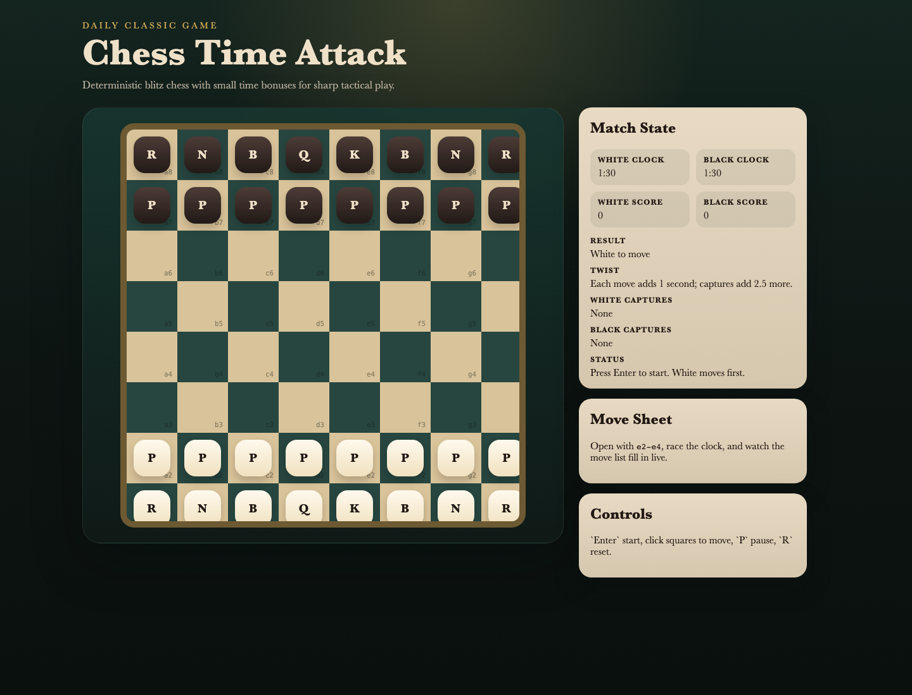
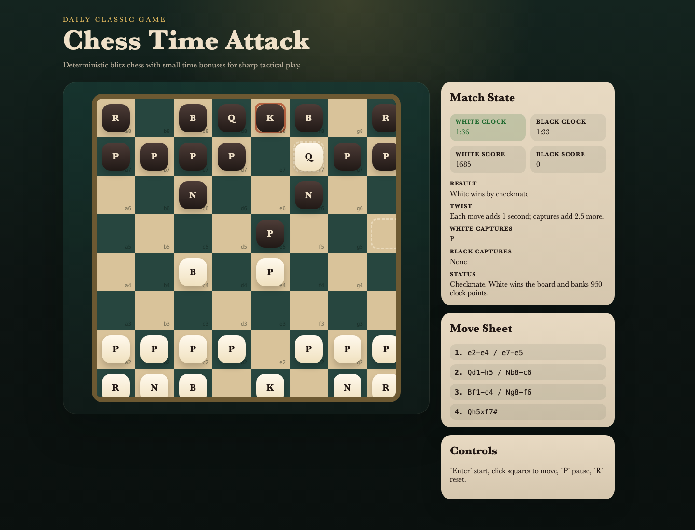

# daily-classic-game-2026-04-28-chess-time-attack

  <h3>Deterministic blitz chess with legal move validation, score tracking, and a time-attack clock race.</h3>
  
Open with principled development, build a mating net, and manage the clock before your rival flags or falls to checkmate.

  
  

## Quick Start
- `pnpm install`
- `pnpm dev`
- Open `http://127.0.0.1:4173`

## How To Play
- Press `Enter` to start the match.
- Click one of your pieces, then click a highlighted target square to make a move.
- Press `P` to pause the clocks and `R` to reset the board.

## Rules
- Standard local two-player chess rules apply, including castling, en passant, check, checkmate, and stalemate detection.
- The active player's clock counts down whenever the match is running.
- Illegal moves that leave your king in check are rejected.

## Scoring
- Captured material awards score by classic piece value.
- Delivering check and checkmate awards bonus score.
- Remaining clock time converts into a final time-attack bonus for the winner.

## Twist
- **Time Attack Chess**: both sides race against a short blitz clock instead of an unlimited board-game pace.
- Each move grants a small time increment, while captures award an extra clock bonus to keep the attack alive.

## Verification
- `pnpm test`
- `pnpm build`
- `pnpm capture`
- Browser hooks:
  - `window.advanceTime(ms)`
  - `window.render_game_to_text()`

## Project Layout
- `src/` game loop, board UI, and deterministic chess rules engine
- `tests/` rules and timer coverage
- `scripts/` build, self-check, and Playwright capture pipeline
- `docs/plans/` implementation notes and scripted click payloads
- `artifacts/playwright/` screenshots, GIF clips, and text state dumps

## GIF Captures
- `clip-01-opening-central-control.gif` - rapid opening development into center control
- `clip-02-battery-setup.gif` - queen and bishop battery under ticking clocks
- `clip-03-scholar-mate-finish.gif` - final forcing line into checkmate
